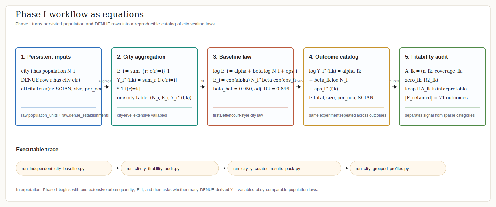
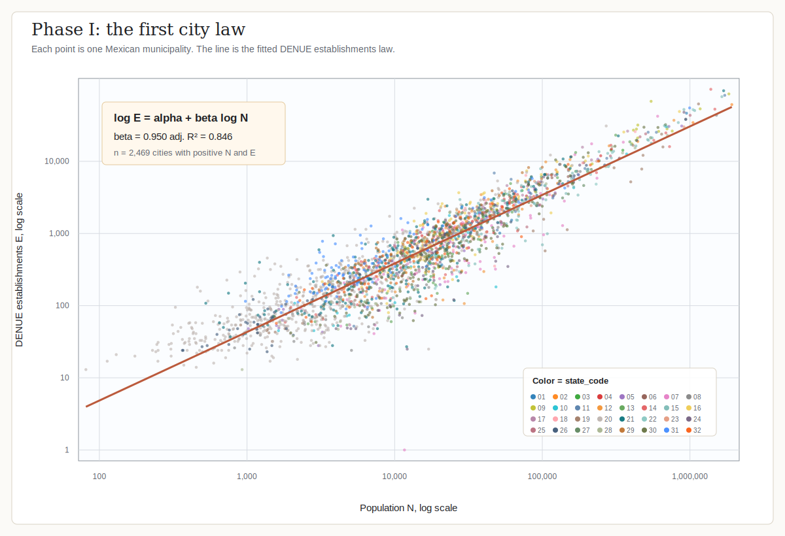
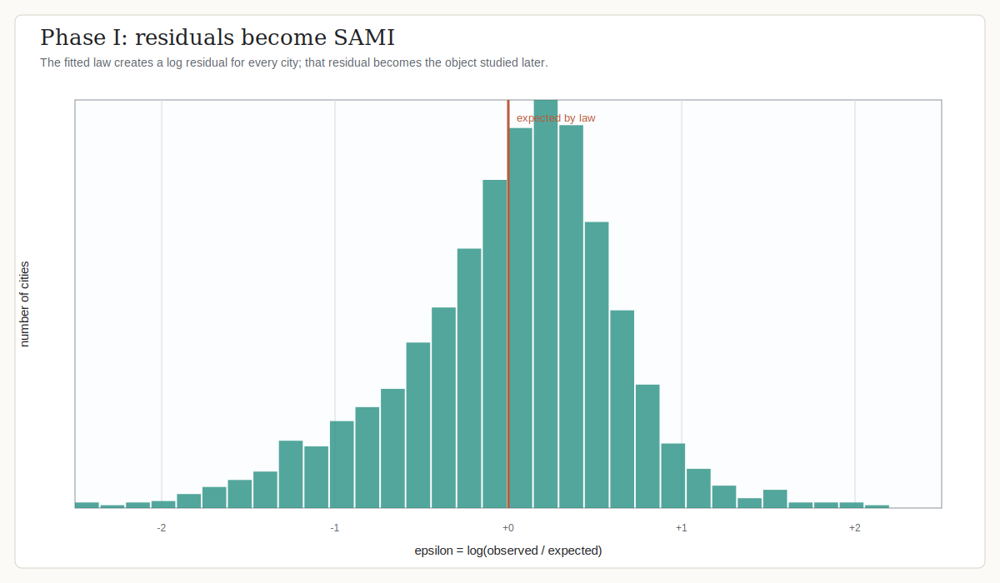
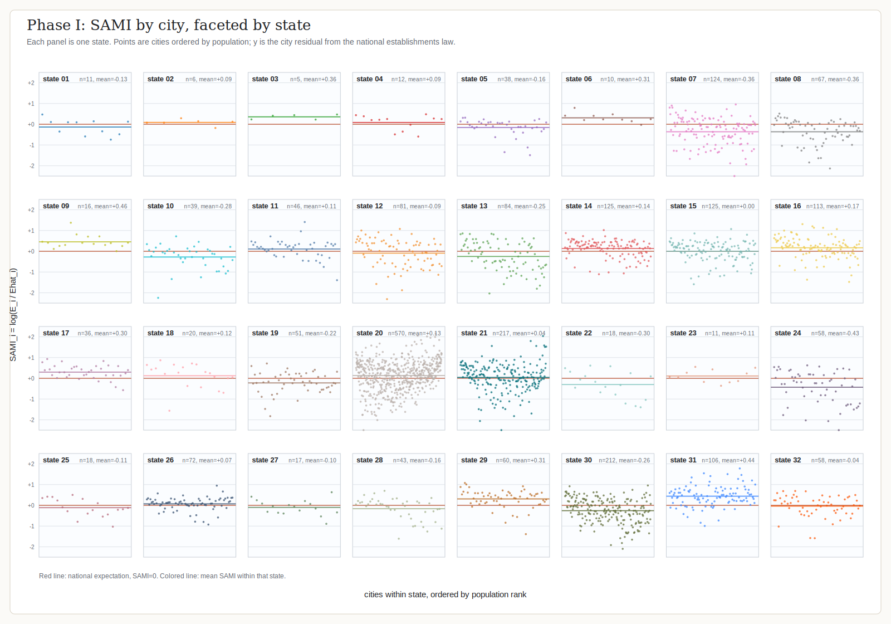
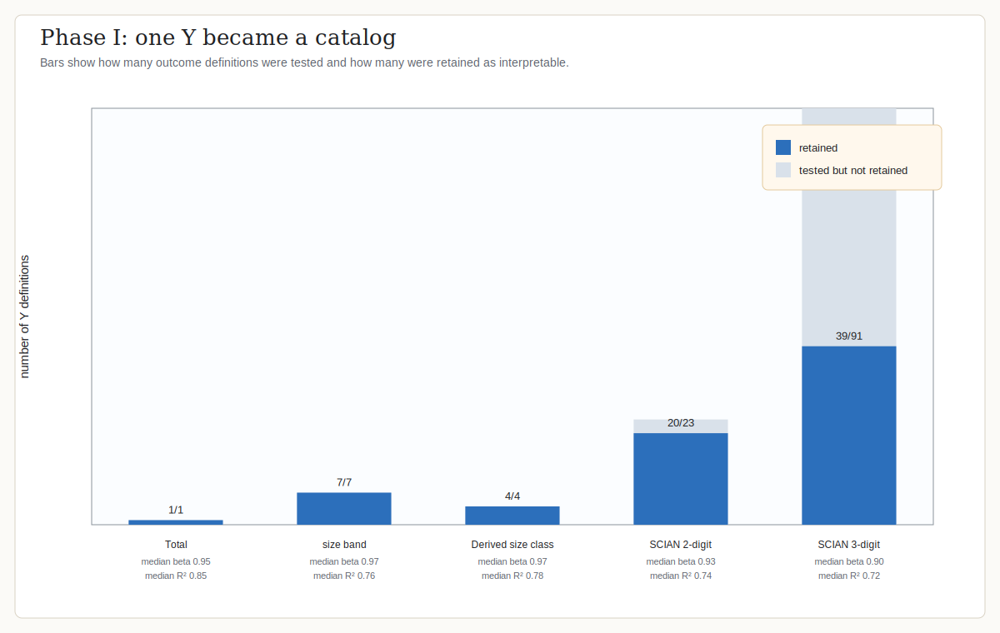
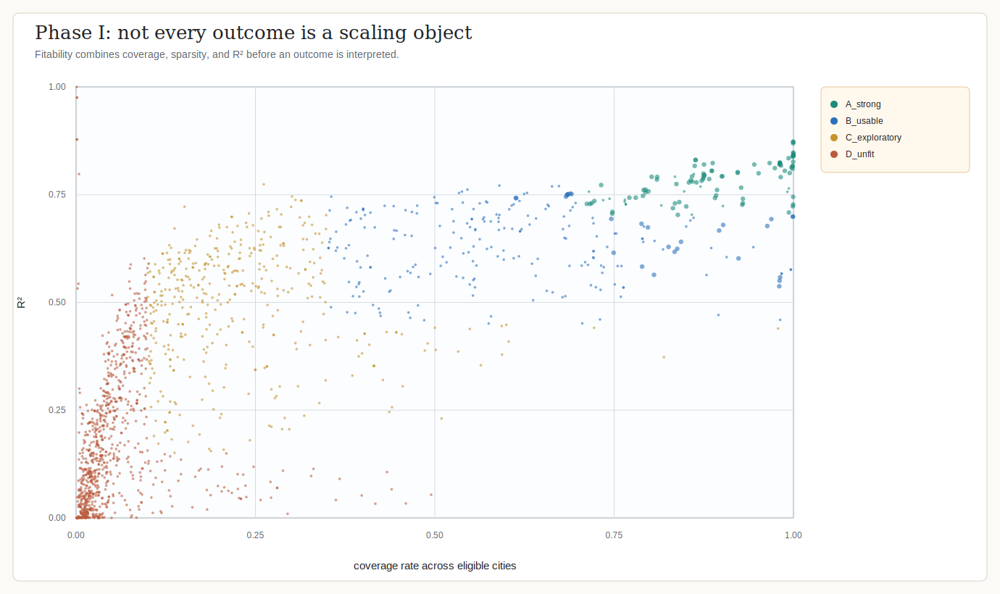
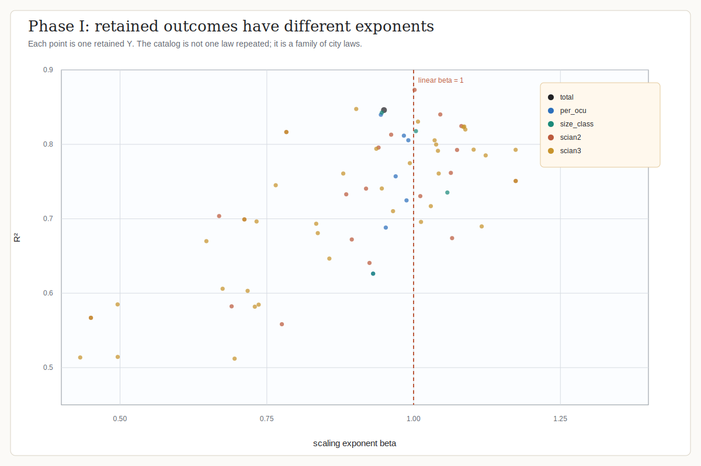

# Phase I Visual Guide

This guide is the visual companion to Phase I of the final monograph.

Phase I asks a deliberately simple question first: do total DENUE establishments scale with city population in Mexico? It then expands the same idea from one outcome to a catalog of economic outcomes.

## 1. Workflow



This figure shows the executable path from persistent database inputs to the fitted city-law catalog.

## 2. First City Law



Each point is one city and point color identifies its Mexican state code. The red line is the fitted law `log E = alpha + beta log N`. The core result is beta near 0.95 with adjusted R2 near 0.846.

## 3. Residuals Become SAMI



After fitting the law, every city has a log deviation from expectation. This residual is the object later mapped and studied as SAMI.

## 4. SAMI by State



This multi-panel figure keeps cities visible instead of collapsing them into one national histogram. Each panel is a state, each point is a city ordered by population, the red line is the national expectation `SAMI = 0`, and the colored line is the state mean.

## 5. Outcome Catalog



The project then stops treating total establishments as the only outcome. It tests and curates DENUE outcome families such as size bands, derived size classes, SCIAN2, and SCIAN3.

## 6. Fitability



This plot explains why outcome curation was necessary. Some categories have strong fits and broad coverage; others are too sparse or weak to interpret as city scaling objects.

## 7. Exponents Across Retained Outcomes



Retained outcomes have different exponents and fit quality. Phase I therefore creates a family of scaling laws, not a single repeated result.

## Reproduce

```bash
PYTHONPATH=src python3 scripts/generate_phase1_explanatory_graphics.py
```

The script reads local Phase I outputs from `dist/independent_city_baseline/` and `reports/city-y-*`, then writes the versioned SVGs under `docs/figures/phase1/`.
